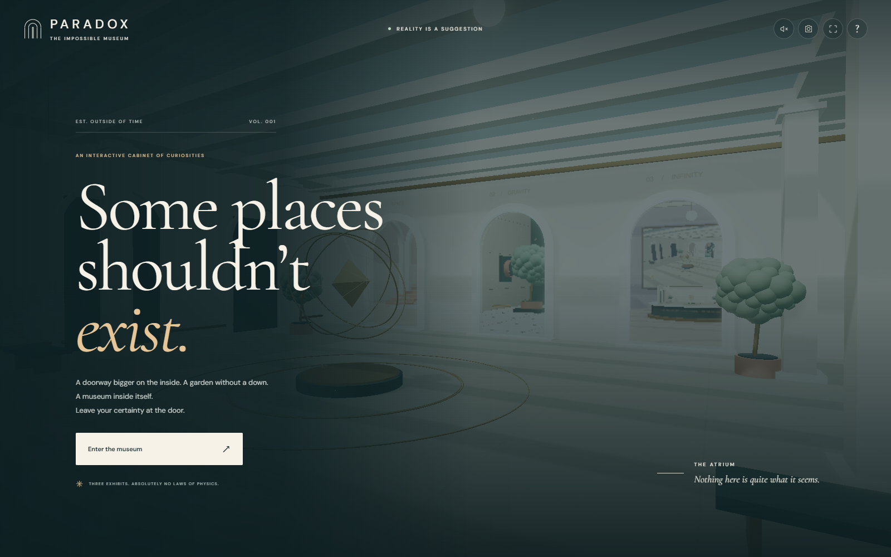
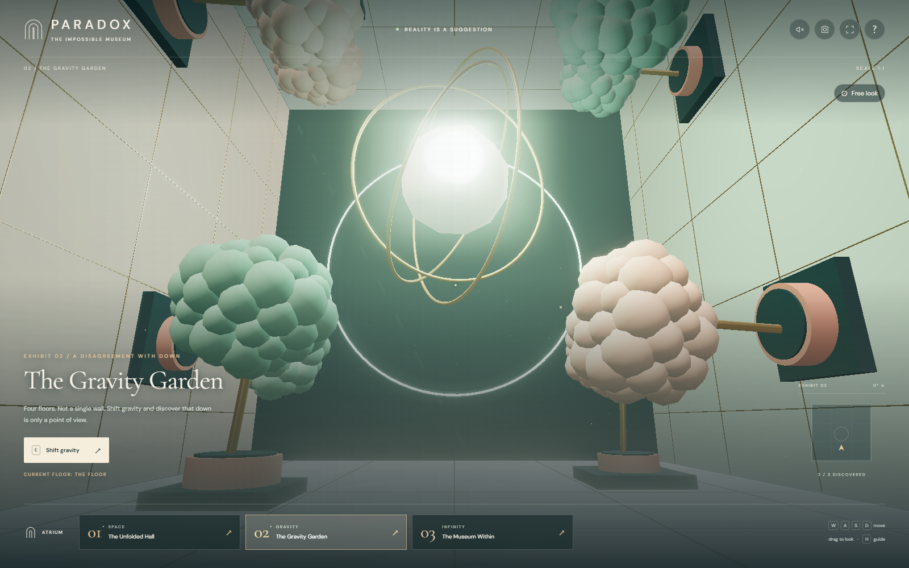
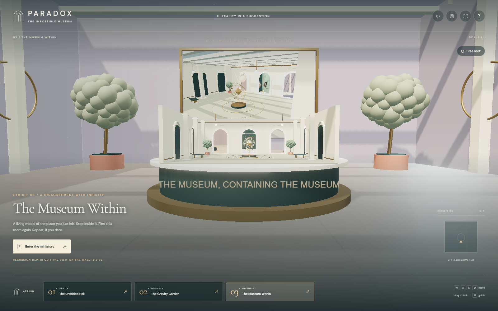
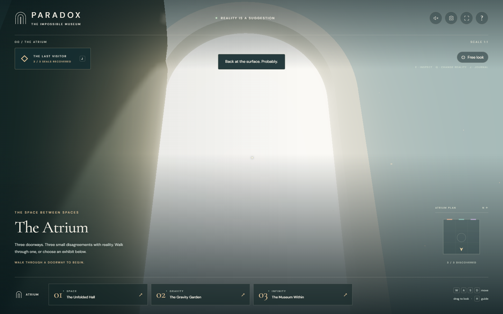

# PARADOX / The Impossible Museum

A walkable Three.js museum of spaces that should not exist. Cross live portals into impossible architecture, rotate gravity beneath your feet, descend into a museum containing itself, or solve a connected escape-room mystery.

<p align="center">
  
</p>

<table>
  <tr>
    <td width="50%"></td>
    <td width="50%"></td>
  </tr>
  <tr>
    <td align="center"><sub>Shift gravity and walk across four different surfaces</sub></td>
    <td align="center"><sub>Enter a museum that contains a live miniature of itself</sub></td>
  </tr>
</table>

<p align="center">
  
  <br>
  <sub><strong>The Last Visitor:</strong> collect evidence, solve three linked exhibits, and physically escape through the recovered exit.</sub>
</p>

## Highlights

- Walk freely through three handcrafted spatial paradoxes connected by real-time portal views.
- Unfold an interior larger than its entrance, rotate the walking plane, and explore recursive architecture.
- Play unrestricted museum exploration or the optional **The Last Visitor** escape challenge.
- Inspect physical clues, maintain a persistent journal, request staged hints, and solve linked room puzzles.
- Use responsive keyboard, mouse, and touch controls with accessibility and performance settings.
- Run completely locally with procedural geometry, generated ambience, bundled fonts, and no runtime network requests.

## Quick start

Requires Node.js **22.18+** (Node 24 recommended) and a current browser with **WebGL 2 and hardware acceleration**.

```powershell
git clone https://github.com/PoojaAgarwal2003/impossible-museum.git
Set-Location impossible-museum
npm ci
npm run dev
```

Open **http://127.0.0.1:5175**. Stop the server with `Ctrl+C`.

On Windows, `.\start.ps1` starts the same development server and restores missing locked dependencies. Development file watching uses polling to tolerate OneDrive file locks.

## The collection

| Exhibit | What happens |
| --- | --- |
| **01 / The Unfolded Hall** | A small arched doorway looks into a much larger space. Cross it to enter a monumental colonnade, then unfold its depth around a suspended golden Mobius strip. |
| **02 / The Gravity Garden** | Each side of the chamber is a planted walking surface. Shift gravity in quarter turns: your camera, walking plane, and return doorway reorient together. |
| **03 / The Museum Within** | A miniature atrium shares the original's geometry and animated sculpture. A framed live camera feed shows the full-sized atrium. Enter the model to descend one recursion level, then find it again. |

This is a designed spatial illusion, not a general-purpose physics or recursive-ray-tracing engine. Portals map the camera between separate scenes. The miniature reuses the atrium at a new narrative scale rather than allocating an unbounded number of nested worlds. Walking collisions cover room boundaries and major exhibits; decorative details are not a full physics mesh.

## The Last Visitor / escape challenge

Choose **Or take the escape challenge** on the arrival screen, or start/resume it from the visitor guide. Normal **Enter the museum** still opens unrestricted exploration. The challenge adds twelve physical artifacts, three linked puzzles, seal inventory, a clue journal, and a hinged departure door.

Look for **floating brass diamonds**. Approach an artifact and press **E**, click the object, or tap its nearby-item prompt. **Q** changes reality in escape mode; **J** opens the journal. Close an inspection before walking or changing a room. Pedestals and the locked door have walking collision.

The surveyor, gardener, and archivist each have a different kind of clue. Solving requires comparing the actual folded/unfolded catalogues, visiting different gravity surfaces, and collecting evidence at specific recursion depths. Guessing a final answer cannot bypass missing evidence or prerequisite seals.

Your journal records inscriptions verbatim, shows the current objective and recovered seals, and offers **three optional hint levels per step**. The last level is explicitly marked as a solution hint. There is no timer or death state. Wrong answers are explained; a wrong gravity press resets only its sequence, never the clues or seals.

Clues, seals, hint usage, and partial witness sequences save separately from exploration discoveries. **R** returns to the original atrium without erasing puzzle progress. Reloading starts you at the atrium; choose **Resume** to keep the challenge. You can suspend the challenge from the journal and continue free exploration. Storage failures are reported, with the current visit remaining playable.

Recovering all three seals is not the ending: decode the departure inscription in the **original** atrium, unlock the door, and **physically walk through it**. The ending offers continued exploration or an explicitly fresh challenge.

<details>
<summary>Developer walkthrough / spoilers</summary>

1. Read the curator's notebook in the atrium.
2. Inspect the shifting catalogue in both hall states. The unchanged shelves are I, V, and VIII: **EYE / KEY / MOON**. Enter them at the invariant cabinet to recover SPACE, numbered **4**.
3. Read the gardener's note and inspect all four gravity witnesses. Press **ROOT (ceiling), BRANCH (right wall), FLOWER (left wall), SEED (floor)**. Turning past a surface is harmless; only presses affect the chain. Recover GRAVITY, numbered **7**.
4. Inspect the echo registry at depths **1 and 2**. In shelf order II, V, VIII, LATE → LAKE, SAND → SEND, and TELL → YELL give **KEY**. Return to depth 0 and certify that word at the registry to recover INFINITY, numbered **2**.
5. At the original atrium's departure lock, order the seals as INFINITY, SPACE, GRAVITY: **247**.
6. Walk through the illuminated door opposite the exhibit portals. Neither entering a code nor visiting a copied exit completes the challenge.

</details>

## Controls

| Input | Action |
| --- | --- |
| W / A / S / D | Walk / strafe |
| Drag on the scene | Look around |
| Free look | Lock the mouse; Escape releases it |
| Arrow up / down; left / right | Walk forward / backward; turn |
| Shift | Walk faster |
| E / exhibit action button | Unfold space, shift gravity, or enter the miniature |
| E / Q / J in escape mode | Inspect a nearby object / change reality / open the clue journal |
| R / Atrium button | Return to the original atrium, resetting recursion depth |
| Exhibit cards | Travel directly to a room |
| H / ? | Visitor guide and rendering settings |
| F | Fullscreen, where supported |
| Camera button | Download a PNG postcard without the interface |
| Sound button | Enable / mute a quiet, generated ambient chord |
| Touch | Swipe to look; on-screen directional buttons to walk |

Walk out through a room's return portal to keep your current recursion depth. Discoveries are saved in browser local storage; unavailable or invalid storage is reported without blocking exploration. Sound starts muted and only initializes after a gesture.

The guide includes low-power / balanced / high rendering, reduced motion, and animation pause. Reduced motion respects the initial operating-system preference, stops decorative animation, and makes gravity and room transitions immediate. Low-power rendering is the mobile default. Hidden tabs skip rendering and suspend enabled sound.

## Development

```powershell
npm test
npm run build
npm run preview
```

The production preview is at **http://127.0.0.1:4175**. The built `dist` directory can be hosted as a static site, including in a subdirectory.

For browser checks, start the development server first, then:

```powershell
npm run test:browser
```

`npm run test:browser` runs both the original exploration checks and a full escape playthrough. `npm run test:escape` runs only the escape checks, including wrong answers, observation requirements, a mid-sequence reload, both recursion depths, the physical exit, ray-cast item clicking, and real touch input.

Browser checks use Microsoft Edge on Windows by default, or Playwright Chromium elsewhere. Set `BROWSER_CHANNEL=chromium` to use installed Playwright Chromium; install it with `npx playwright install chromium` if needed. Set `MUSEUM_URL` to test another origin, such as the production preview. Screenshots and test artifacts go into the ignored `artifacts` directory.

## Implementation

- `src/world.ts`: procedural architecture, sculpture, planting, miniature, and scene lighting.
- `src/renderer.ts`: camera-relative portal rendering, destination clipping, bounded render scheduling, bloom, and postcards.
- `src/portal-math.ts`: independently tested camera mapping and clipping-plane calculations.
- `src/navigation.ts`: room metadata, movement, collision constraints, doorway crossings, and recursion labels.
- `src/main.ts`: exploration state, input, accessibility, exhibit mechanics, and UI.
- `src/audio.ts`: gesture-activated Web Audio ambience.
- `src/escape.ts`: pure puzzle rules, inscriptions, artifacts, hints, and validated save state.
- `src/escape-controller.ts`: proximity/ray-cast inspection, journal, inventory, puzzle forms, and the escape sequence.
- `src/escape.css`: escape-specific interface styling; free exploration remains intact.

No runtime external requests, accounts, analytics, API keys, or downloaded art assets.
